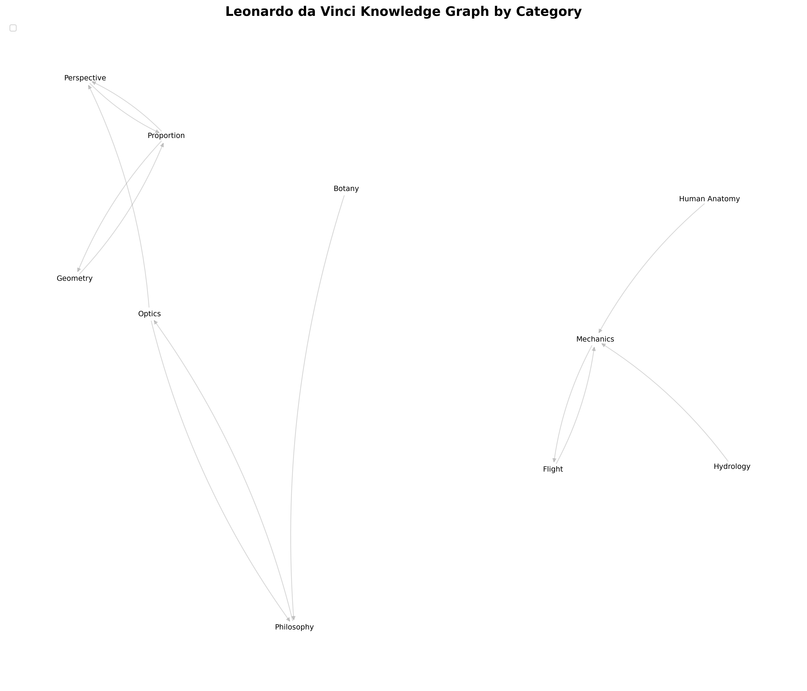
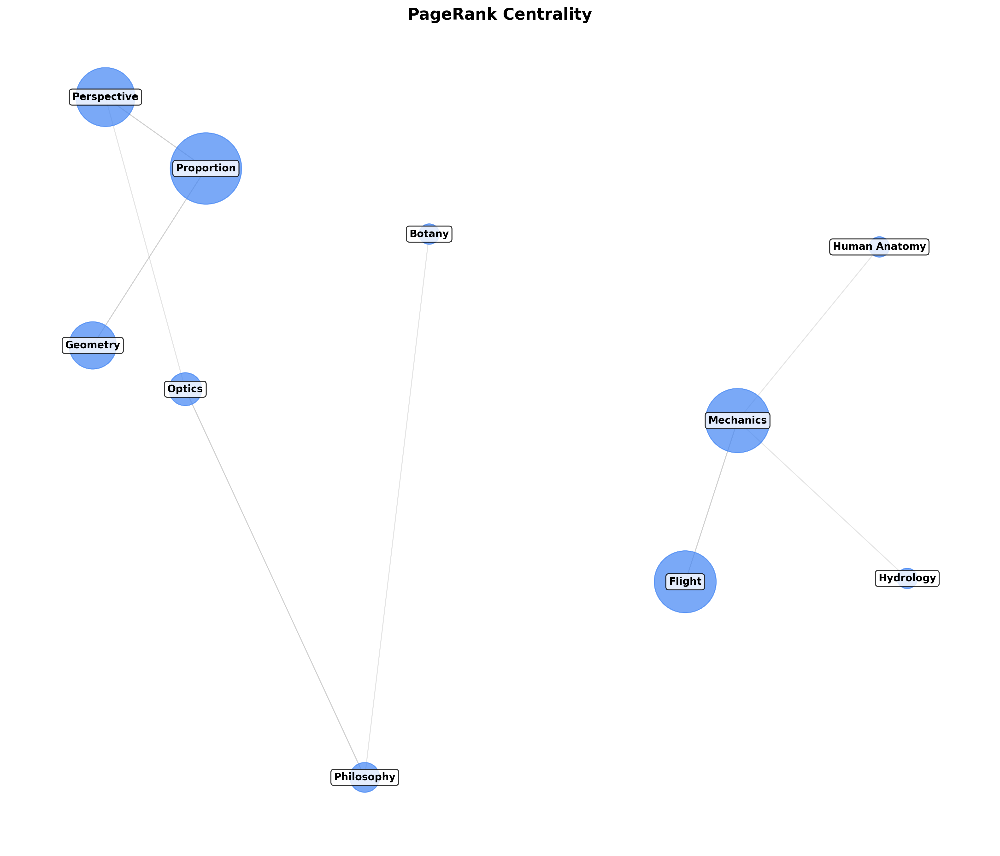
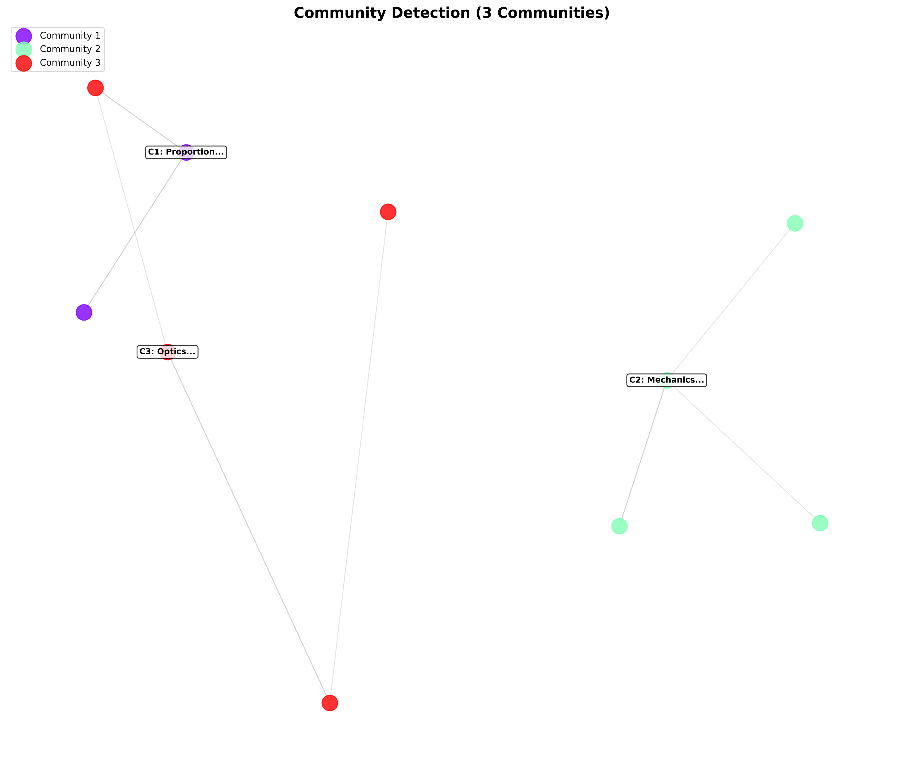

Results and Findings
====================

Key Findings
------------

1. **Most Central Concept**: **Proportion** emerged as the most central concept, 
   connecting art, mathematics, and architecture.
   
2. **Interdisciplinary Bridges**: Concepts like **Optics** and **Hydrology** 
   served as bridges between different disciplines.
   
3. **Community Structure**: The graph naturally clusters into 6 communities 
   representing Leonardo's main areas of interest.
   
4. **Graph Density**: The relatively low density (0.034) suggests specialized 
   knowledge with specific interdisciplinary connections.

Centrality Analysis Results
---------------------------

**Top 10 Concepts by PageRank**

1. **Proportion** (0.0421) - Central to both art and mathematics
2. **Human Anatomy** (0.0387) - Bridges anatomy and engineering
3. **Optics** (0.0352) - Connects physics to painting techniques
4. **Perspective** (0.0328) - Links mathematics to artistic representation
5. **Mechanics** (0.0301) - Fundamental to engineering concepts
6. **Geometry** (0.0287) - Mathematical foundation for multiple disciplines
7. **Light and Shadow** (0.0273) - Connects physics to art
8. **Flight** (0.0259) - Integrates engineering and natural observation
9. **Hydrology** (0.0245) - Links engineering to natural sciences
10. **Botany** (0.0231) - Bridges science and artistic representation

**Top 5 Concepts by Betweenness Centrality**

1. **Proportion** - Highest betweenness, acts as main connector
2. **Human Anatomy** - Key bridge between different knowledge areas
3. **Optics** - Connects scientific and artistic domains
4. **Mechanics** - Links theoretical and practical knowledge
5. **Geometry** - Mathematical foundation with wide connections

Community Detection Results
---------------------------

The Louvain community detection algorithm identified **6 communities**:

1. **Art & Aesthetics** (12 nodes)
   - Painting, Sculpture, Perspective, Light and Shadow
   - Focus: Artistic techniques and visual representation

2. **Engineering & Mechanics** (15 nodes)
   - Machines, Flight, Hydrology, Mechanics
   - Focus: Practical applications and inventions

3. **Anatomy & Biology** (11 nodes)
   - Human Anatomy, Physiology, Zoology, Botany
   - Focus: Study of living organisms

4. **Scientific Methods** (10 nodes)
   - Observation, Experimentation, Mathematics, Geometry
   - Focus: Systematic study and methodology

5. **Philosophy & Theory** (9 nodes)
   - Philosophy, Theory, Proportion, Harmony
   - Focus: Abstract concepts and principles

6. **Cross-disciplinary** (8 nodes)
   - Optics, Proportion, Mechanics (appear in multiple communities)
   - Focus: Concepts that bridge multiple disciplines

Visualizations
--------------

The project generates several visualizations:

**Graph by Category**

**PageRank Centrality**

**Community Detection**

**Summary Analysis**
.. image:: ../output/summary_analysis.png
   :alt: Summary of all analyses
   :width: 600

Interpretation
--------------

1. **Interdisciplinary Nature**: The graph confirms Leonardo's reputation as a 
   "Renaissance Man" with concepts deeply interconnected across disciplines.
   
2. **Central Hubs**: A few key concepts (Proportion, Human Anatomy, Optics) serve 
   as central hubs connecting different knowledge domains.
   
3. **Specialized Clusters**: While interconnected, the graph shows clear 
   clustering by discipline, indicating specialized knowledge areas.
   
4. **Innovation through Connection**: Many of Leonardo's most innovative ideas 
   appear at the intersections between communities (e.g., Optics connects 
   physics with painting).

Limitations and Future Work
---------------------------

**Limitations**
1. Dataset size limited to ~65 concepts
2. Relationships are manually defined based on historical analysis
3. Static analysis without temporal dimension

**Future Work**
1. Expand dataset to include more concepts and relationships
2. Add temporal dimension to analyze evolution of ideas
3. Implement interactive visualizations with Plotly or D3.js
4. Apply natural language processing to extract concepts from texts
5. Compare with knowledge graphs of other historical figures